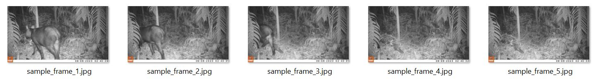

# photoextractor 

<!-- badges: start -->
[](https://cran.r-project.org/package=photoextractor)
[](https://lifecycle.r-lib.org/articles/stages.html#stable)
[](https://github.com/dlizcano/photoextractor)
[](https://github.com/dlizcano/photoextractor)
<!-- badges: end -->


The `photoextractor` R package allows you to extract single frames (pictures) from videos while preserving and stamping the original metadata from the video into the extracted images.
The package can be useful to convert camera trap videos to image sequences preserving the original date and time. 

🎞️ + ✂️ = 🖼️

## ⏬ Installation

`photoextractor` is not in CRAN yet 🛑. However You can install the development version from GitHub with:

```r
# install.packages("devtools")
devtools::install_github("dlizcano/photoextractor")
```


### External Dependencies

This package relies on 🔨 [**ExifTool**](https://exiftool.org/) 🔨. After installing the package, you must ensure **ExifTool** is installed and 
available in your computer. The [`exiftoolr`](https://joshobrien.github.io/exiftoolr/) package can download and install the **ExifTool** for you, just run:

```r
exiftoolr::install_exiftool()
```

## Usage

### 🎬 Single Video Extraction

To extract frames from a single video. The video can be any of the following formats: 
avi, mp4, mov, mkv, or m4v. 


```r
library(photoextractor)

# Create an extractor object
ext <- VideoFrameExtractor(
  video_path       = "path/to/your/video.mp4", 
  output_dir       = "path/to/output/frames", 
  fps              = 1,            # 1 frame per second
  format           = "jpg",        # photo format "jpg" or "png"
  camera_tz_offset = -5            # Timezone offset (e.g., -5 for Colombia)
)

# Run the extraction
ext <- extract(ext, verbose = TRUE)

# Verify that timestamps were stamped correctly
verify_timestamps(ext)
```

### 📁 Batch Folder Processing

To process all videos in a folder. The videos can be any of the following formats: 
avi, mp4, mov, mkv, or m4v

```r
library(photoextractor)

# Create a folder extractor object
folder_ext <- FolderExtractor(
  folder_path      = "path/to/videos",
  output_dir       = "path/to/output",
  fps              = 1,           # 1 frame per second
  format           = "jpg",       # photo format "jpg" or "png"
  camera_tz_offset = -5           # Timezone offset (e.g., -5 for Colombia)
)

# Run batch extraction
folder_ext <- extract(folder_ext, verbose = TRUE)

# Verify that timestamps were stamped correctly
print(folder_ext@results)
```

## Example


```r
library(photoextractor)

# Use a sample video
video_file <- system.file("extdata", "sample.mp4", package = "photoextractor")

frames <- VideoFrameExtractor(
  video_path       = video_file, 
  output_dir       = paste(getwd(), "/frames", sep=""),  # change if you want
  fps              = 1,            # 1 frame per second
  format           = "jpg",        # photo format "jpg" or "png"
  camera_tz_offset = -5            # Timezone offset (e.g., -5 for Colombia)
)

# Run the extraction
ext <- extract(frames , verbose = TRUE)

# Verify that timestamps were stamped correctly
verify_timestamps(ext)

```
Check you have five pictures in the folder `frames` in your working directory.



## Features

- **Metadata Preservation**: Automatically reads video start time from EXIF/metadata.
- **Timestamp Stamping**: Writes `DateTimeOriginal`, `CreateDate`, and filesystem timestamps to extracted frames.
- **Timezone Correction**: Handles UTC offsets and camera clock corrections.
- **Organized Output**: Automatically renames frames to include the source video name and zero-padded indices.
- **Modern OOP**: Built using the new **S7** object system for R.


